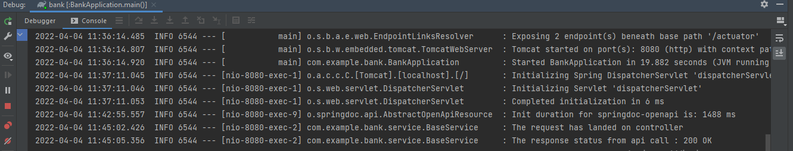

# bank-service

The service provides the GET endpoint to access the ATM details for the llyods bank using the open-api.

1. Create logging and demonstrate it by logging to the console.

2. OpenAPI swagger specs can be found at below url : http://localhost:8080/swagger-ui/index.html

3. A jar file which can be used to run as a docker image.

4. The actuator endpoints activated for the service :
* http://localhost:8080/actuator/
* http://localhost:8080/actuator/health
* http://localhost:8080/actuator/metrics/

5. Postman collection has bene added to test the service : bank-service.postman_collection.json